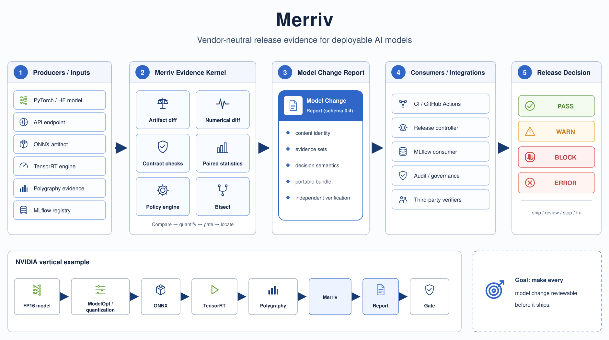
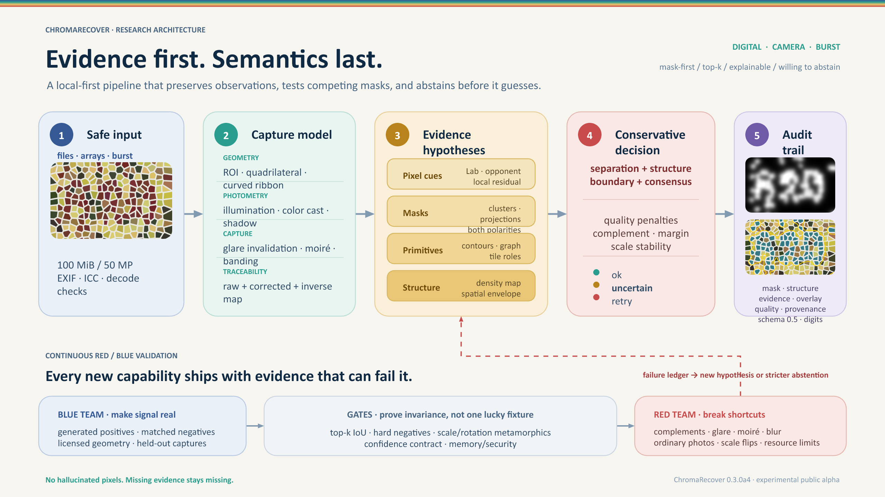

::: {.home-shell}
::: {.profile-intro #about}
::: {.intro-main}

PROFILE / 2026

# Niansia

Computer science graduate preparing for graduate study in AI security, computer vision, and vision-language models.

I graduated in 2026 with a degree in Computer Science from **Yuan Ze University** and am currently preparing applications to graduate programs. My interests center on the security, robustness, and reasoning capabilities of visual and multimodal intelligent systems.

I am especially interested in how evidence is collected, how reasoning fails, how uncertainty is communicated, and how experiments can be reproduced by other researchers.

<a href="mailto:wilbur930202@gmail.com">Email</a>/<a href="https://github.com/niansia">GitHub</a>/<a href="#work">Selected work</a>

:::

::: {.intro-side}

  Currently
  
Preparing graduate applications while exploring security, robustness, evaluation, and reasoning in visual and multimodal AI systems.

  Open to
  
Research conversations, reproducibility work, unusual datasets, and well-defined failure cases.

  Contact
  
<a href="mailto:wilbur930202@gmail.com">wilbur930202@gmail.com</a>

:::
:::

::: {.section-block #research}
::: {.section-rail}
01
<h2>Research areas</h2>
:::

::: {.section-content}

My current interests are organized around two closely related research areas.

::: {.question-list}
::: {.question-item}
A

<h3>AI &amp; multimodal security</h3>

How can visual and multimodal AI systems remain secure, robust, and auditable under adversarial inputs, weak evidence, and real-world uncertainty?

Security · robustness · adversarial / failure analysis · content integrity · trustworthy evaluation

:::

::: {.question-item}
B

<h3>Vision &amp; multimodal intelligence</h3>

How can computer vision and vision-language systems preserve visual evidence, reason across modalities and time, and be evaluated for grounding rather than fluency alone?

Computer vision · VLMs · multimodal reasoning · memory · evaluation

:::
:::

<strong>Additional interests.</strong> Quantitative machine learning, interactive systems, and research software.

Some active research projects remain private during development and review; code, results, and reproducible artifacts will be released when appropriate.

:::
:::

::: {.section-block #work}
::: {.section-rail}
02
<h2>Selected work</h2>
:::

::: {.section-content}
::: {.work-entry}
::: {.work-image .work-image--contain}
{fig-alt="Merriv release evidence architecture"}
:::
::: {.work-copy}

Model release infrastructure · pre-alpha2026

### Merriv

A vendor-neutral release-evidence layer for deployable AI models, currently in pre-alpha. It binds exact artifacts, paired evaluation, statistical policy, provenance, and regression onset into a portable Model Change Report that can be independently checked before promotion.

<a href="https://github.com/niansia/Merriv">Code</a>/<a href="https://github.com/niansia/Merriv/blob/main/docs/release-evidence-case-study.md">Case study</a>

:::
:::

::: {.work-entry}
::: {.work-image .work-image--contain}
{fig-alt="ChromaRecover evidence-first computer vision architecture"}
:::
::: {.work-copy}

Computer vision tool · public alpha2026

### ChromaRecover

A local-first Python toolkit for recovering spatial structure carried by subtle color differences. It compares competing chromatic hypotheses, preserves masks, overlays, quality signals and provenance, and returns an uncertain or retry status instead of forcing a label when evidence is weak.

<a href="https://github.com/niansia/ChromaRecover">Code</a>/<a href="https://github.com/niansia/ChromaRecover/blob/main/docs/algorithm.md">Algorithm notes</a>

:::
:::

::: {.work-entry}
::: {.work-image}
{fig-alt="NoveltyAudit evidence pipeline and citation-graph architecture"}
:::
::: {.work-copy}

Research tool2026

### NoveltyAudit

An evidence-first agent skill for adversarial scholarly novelty audits. It decomposes claims, searches for minimal prior sets, applies historical cutoffs, and records bridge-dependent prior-work arguments.

<a href="https://github.com/niansia/NoveltyAudit">Code</a>/<a href="https://github.com/niansia/NoveltyAudit#readme">Documentation</a>

:::
:::

::: {.compact-work .compact-work--single}

Research workflow · early alpha<h3>Research Meeting Coach</h3>
An evidence-grounded Agent Skill that turns raw research progress into decision-ready advisor meetings while keeping claims within the supplied evidence.
<a href="https://github.com/niansia/research-meeting-coach">Code ↗</a>

:::

<a href="https://github.com/niansia?tab=repositories">All repositories →</a>

:::
:::

::: {.section-block .last-section #contact}
::: {.section-rail}
03
<h2>Contact</h2>
:::

::: {.section-content}

If you are working on AI security, computer vision, vision-language models, trustworthy multimodal AI, reproducibility, or research tooling, I welcome thoughtful conversations and possible collaborations.

<a href="mailto:wilbur930202@gmail.com">wilbur930202@gmail.com</a>

:::
:::
:::
